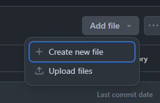
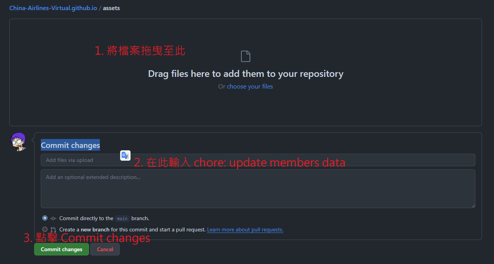

# 中華虛擬航空 官方網站

## 如何更新成員名單

1. 下載最新[成員名單](https://raw.githubusercontent.com/China-Airlines-Virtual/China-Airlines-Virtual.github.io/main/assets/members.csv)
2. 用 Excel 打開並按照格式編輯（切勿任意新增直行）

**注意：最第一欄的id，請依序增加並不可重複，若成員離開讓他空號即可**
3. 打開[網頁](https://github.com/China-Airlines-Virtual/China-Airlines-Virtual.github.io/tree/main/assets)，點擊 `Add file` -> `Upload files`

4. 將剛剛編輯的 `members.csv` 拖到方塊中，在 Commit changes 欄位填寫 `chore: update members data`，然後點擊 `Commit changes`
