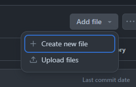
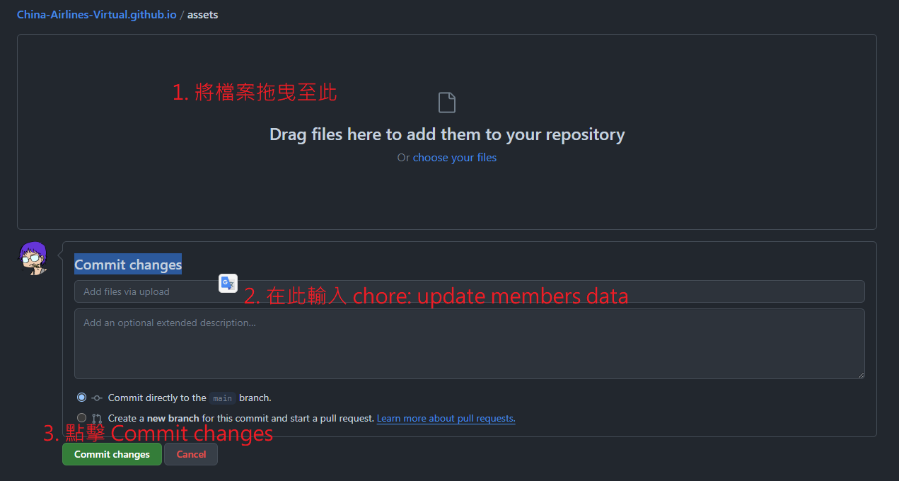

# 中華虛擬航空 官方網站

本站使用 [Eleventy](https://www.11ty.dev/) 產生靜態頁面，
由 GitHub Actions 建置 `_site/` 後部署到 GitHub Pages。

> ⚠️ Repo 根目錄**不再**放 `index.html`、`flight-history-*.html`、`sitemap.xml`，
> 這些檔案都是建置產生的。要改內容請改 `_data/` 與 `pages/`。

## 目錄結構

| 路徑 | 用途 |
| --- | --- |
| `_data/site.json` | 站台設定：網址、社群連結、合作夥伴、統計頁籤 |
| `_data/flights.json` | **聯飛紀錄清單（唯一來源）** |
| `_data/i18n.json` | 中／英文介面字串 |
| `_includes/` | 共用版型與 header / footer / 隱私權區塊 |
| `pages/index.njk` | 首頁模板，會產生 `index.html` 與 `index-en.html` |
| `pages/flight-history.njk` | 聯飛紀錄模板，每筆 flight 產生一頁 |
| `pages/sitemap.njk` | 產生 `sitemap.xml` |
| `assets/` | 圖片、CSS、JS、資料檔（原樣複製到網站） |

## 如何新增一場聯飛紀錄

1. 把該場聯飛的時間軸放到 `assets/timeline/timeline-YYYYMMDD.json`
2. 在 `_data/flights.json` 加一筆：

   ```json
   {
     "id": "20260822",
     "date": "2026-08-22",
     "listed": true,
     "title": { "zh-TW": "活動名稱", "en": "Event name" },
     "image": null,
     "lines": {
       "zh-TW": ["活動說明第一行", "活動說明第二行"],
       "en": ["Line one", "Line two"]
     },
     "timeline": "assets/timeline/timeline-20260822.json",
     "map": { "lat": 24.0, "lon": 116.7, "zoom": 6 }
   }
   ```

   - 若說明是一張圖，把 `image` 設成圖片路徑（例如 `assets/img/flight-history/20260822.png`），`lines` 留空陣列。
   - `listed` 設為 `false` 時該頁仍會產生，但不會出現在其他頁的「其他聯飛紀錄」按鈕清單。

3. Commit 並 push。

導覽列連結、首頁的聯飛地圖、每一頁的「其他聯飛紀錄」按鈕清單、`sitemap.xml`
都會依照 `date` 最新的一筆自動更新，不需要手動改任何 HTML。

## 如何更新成員名單

1. 下載最新[成員名單](https://raw.githubusercontent.com/China-Airlines-Virtual/China-Airlines-Virtual.github.io/main/assets/members.csv)
2. 用 Excel 打開並按照格式編輯（切勿任意新增直行）

**注意：最第一欄的id，請依序增加並不可重複，若成員離開讓他空號即可**
3. 打開[網頁](https://github.com/China-Airlines-Virtual/China-Airlines-Virtual.github.io/tree/main/assets)，點擊 `Add file` -> `Upload files`

4. 將剛剛編輯的 `members.csv` 拖到方塊中，在 Commit changes 欄位填寫 `chore: update members data`，然後點擊 `Commit changes`


## 本機開發

```bash
npm install
npm start     # http://localhost:8080，存檔自動重新整理
npm run build # 產生 _site/
```

## 部署

`.github/workflows/deploy.yml` 會在 push 到 `main` 時建置並部署。

- **Repo 設定需求**：Settings → Pages → Source 必須設為 **GitHub Actions**。
- `assets/statistics.json` 由另一個 repo 的 Action 以 PAT commit，
  PAT 推送的 commit 會觸發本 repo 的 workflow，所以統計更新後會自動重新部署。
- 另外設有每日排程與 `workflow_dispatch`，可在 PAT 失效時作為備援或手動重跑。
